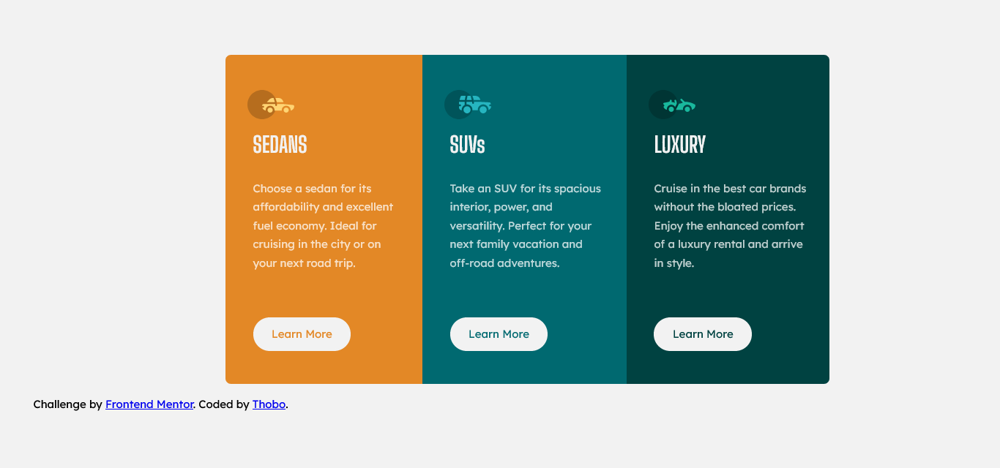

# Frontend Mentor - 3-column preview card component solution

This is a solution to the [3-column preview card component challenge on Frontend Mentor](https://www.frontendmentor.io/challenges/3column-preview-card-component-pH92eAR2-). Frontend Mentor challenges help you improve your coding skills by building realistic projects. 

## Table of contents

- [Overview](#overview)
  - [The challenge](#the-challenge)
  - [Screenshot](#screenshot)
  - [Links](#links)
- [My process](#my-process)
  - [Built with](#built-with)
  - [What I learned](#what-i-learned)
  - [Continued development](#continued-development)
  - [Useful resources](#useful-resources)
- [Author](#author)

**Note: Delete this note and update the table of contents based on what sections you keep.**

## Overview

### The challenge

Users should be able to:

- View the optimal layout depending on their device's screen size
- See hover states for interactive elements

### Screenshot

### Links

- Solution URL: [Add solution URL here](https://your-solution-url.com)
- Live Site URL: [Add live site URL here](https://your-live-site-url.com)

## My process

### Built with

- Semantic HTML5 markup
- CSS custom properties
- Flexbox

### What I learned

I learned how to use flexbox and css custom properties in a responsive design.

### Continued development

I want to continue improving my skills on front end development, trying out new and exciting technologies just to get comfortable with it before fully focusing on full stack web development.

### Useful resources

- [Mozilla Developer Network](https://www.example.com) - This helped me for XYZ reason. I really liked this pattern and will use it going forward.

- [Modern CSS Master the Key Concepts of CSS for Modern Web Development by Joe Attardi] - This book helped me understand some of the underlying principles of using css in a responsive context.

## Author

- Frontend Mentor - [@Thobo-ops](https://www.frontendmentor.io/profile/Thobo-ops)
